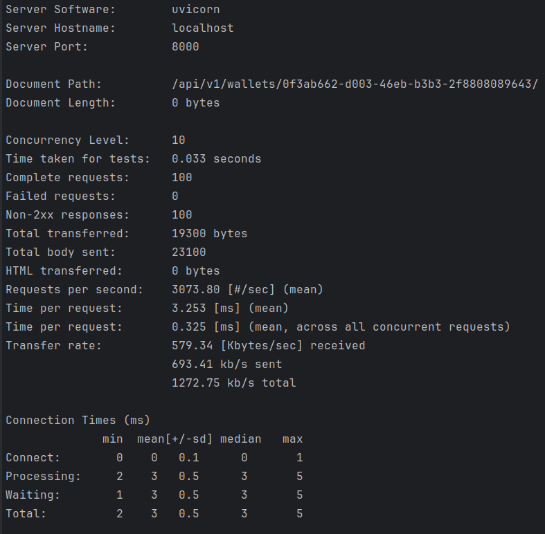

# Wallet manager
Web-приложение, написанное на фреймворке FastAPI, которое по REST принимает запрос вида  
POST api/v1/wallets/<WALLET_UUID>/operation  
{   operationType: DEPOSIT or WITHDRAW,  
amount: 1000  
}  
после выполняет логику по изменению счета в базе данных.  
Также есть возможность получить баланс кошелька
GET api/v1/wallets/{WALLET_UUID}

### Содержание:
* [Используемые технологии](#используемые-технологии-)
* [Запуск проекта локально](#запуск-проекта-локально)
* [Запуск приложения с помощью Docker compose](#запуск-приложения-с-помощью-docker-compose)
* [Тестирование проекта с помощью Swagger UI](#тестирование-проекта-с-помощью-swagger-ui)
* [Нагрузочное тестирование](#нагрузочное-тестирование)
### Используемые технологии: 
* Python 3.11
* FastAPI
* SQLAlchemy
* Pydantic
* PostgreSQL
* Alembic
* Pytest
* JWT
* docker-compose

### Запуск проекта локально
1. Клонируйте проект с помощью команды:  
git clone https://github.com/mike-sazonov/Javacode_test.git  
2. Настройте виртуальную среду
3. В корне проекта создайте файл .env и заполните своими данными по примеру:  
DB_HOST=localhost 
DB_PORT=5432 
DB_USER=postgres 
DB_PASS=db_pass 
DB_NAME=db_name 
DB_NAME_TEST=db_name_test  

4. Командой **python -m pytest tests/** запускаем тесты.
5. Перед первым запуском проекта, совершаем первую миграцию с помощью Alembic: 
* Командой **alembic revision --autogenerate**, проверяем миграцию по адресу: Директория_проекта/alembic/versions
* Командой **alembic upgrade head** вносим изменения в нашу БД.

### Запуск приложения с помощью Docker compose
* Для запуска приложения с помощью Docker compose, в корневой папке создайте файл docker.env со своими данными:   
DB_HOST=db 
DB_PORT=5432 
DB_USER=postgres 
DB_PASS=db_pass 
DB_NAME=db_name 
DB_NAME_TEST=db_name_test  

* В консоли запускаем проект командой: docker compose up

### Тестирование проекта с помощью Swagger UI

* **Запустите проект из файла main.py, после чего перейдите по ссылке** http://127.0.0.1:8000/docs.  

* **Баланс кошелька по uuid (GET):**

Ответ:

* **Операция DEPOSIT по uuid кошелька (POST):**

Ответ:

### Нагрузочное тестирование

С помощью ApacheBench проведем нагрузочное тестирование конечных точек со следующими параметрами:   
Конечная точка GET api/v1/wallets/{WALLET_UUID} 

 
Результаты:
 

 
Конечная точка POST api/v1/wallets/<WALLET_UUID>/operation 

 
Результаты:
 

